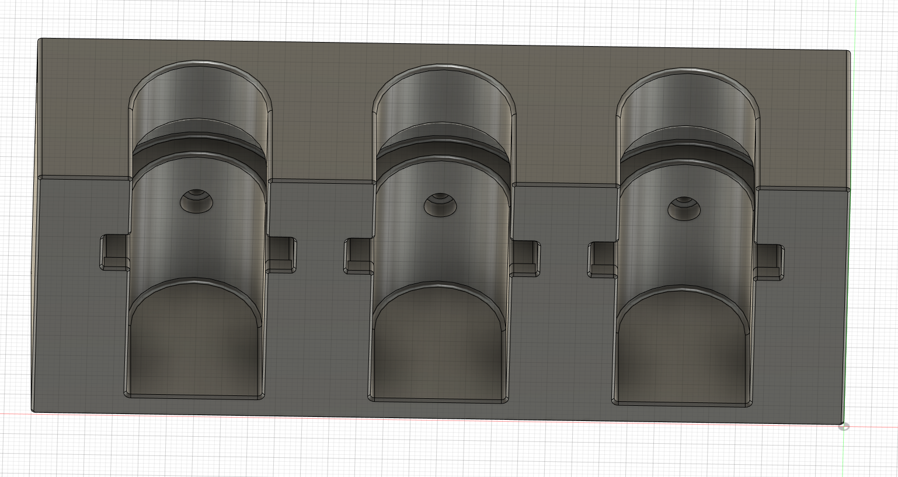

3D Printable Reloading Die Holder
===

# Notes
The default height (from the bottom of the lock ring to the bottom of the reloading die) is 32mm which is designed for Forester CO-AX press. That height can be adjusted to accommodate different parts.

# Printed Part

